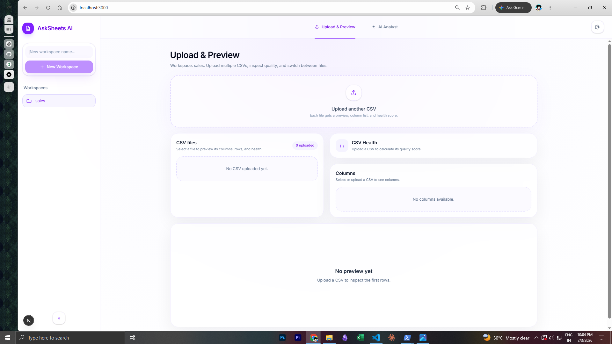
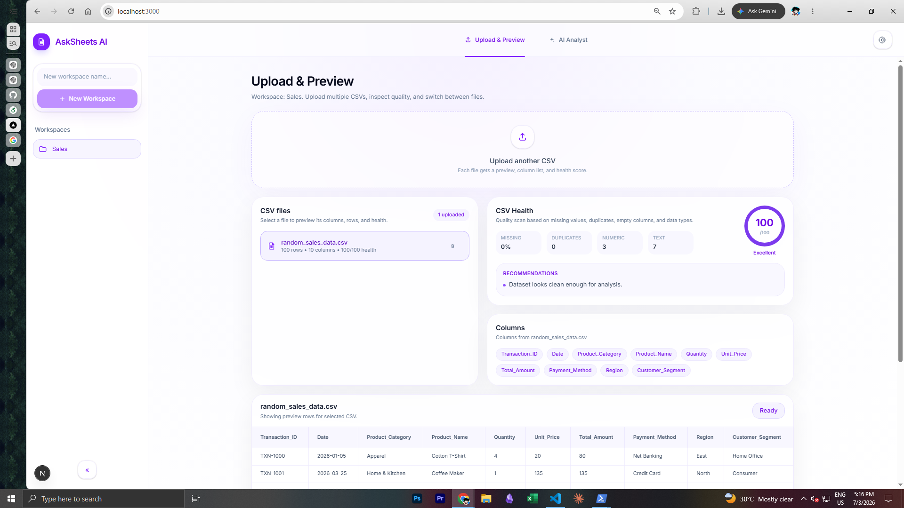
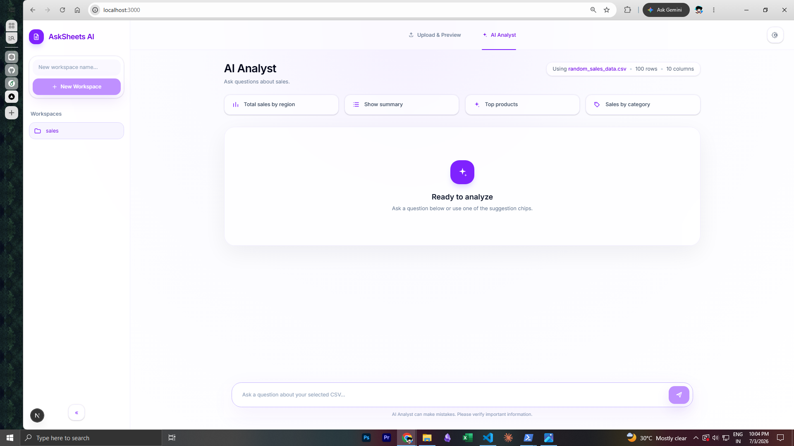
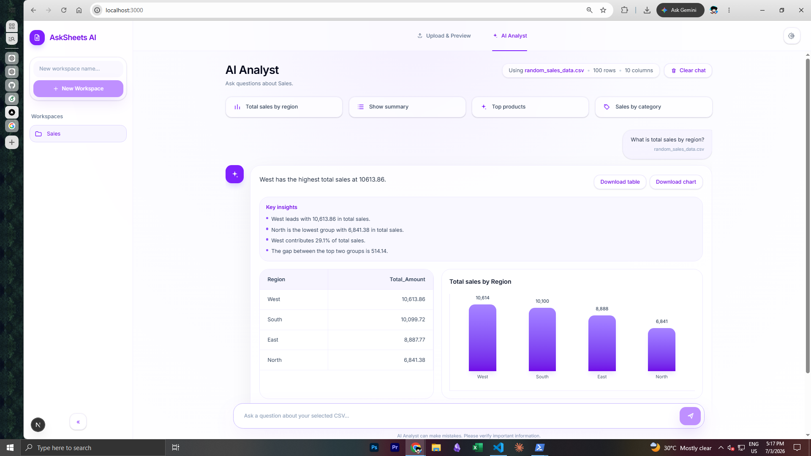

# AskSheets AI

AskSheets AI is a full-stack CSV analytics workspace that lets users create workspaces, upload multiple CSV files, inspect dataset quality, preview rows and columns, ask analysis questions, generate insights, view charts, and download results.

The current MVP uses deterministic Pandas-powered analysis for reliability and safe execution. The next planned version adds a Gemini/OpenAI query-planning layer so broader natural-language questions can be converted into validated dataframe operations.

---

## Preview

### Upload & Preview



### CSV Health Score



### AI Analyst



### Chat Response, Insights, Charts, and Downloads



---

## What AskSheets AI Does

AskSheets AI is designed as a lightweight data analysis assistant for CSV files.

Instead of opening Excel, manually checking columns, writing formulas, and building charts, users can:

1. Create a workspace.
2. Upload one or more CSV files.
3. Check file quality with a CSV health score.
4. Preview rows and inspect columns.
5. Ask analysis questions in a chat-style interface.
6. Receive computed answers, tables, charts, insights, and follow-up questions.
7. Download generated outputs.

The project is built to demonstrate a practical full-stack AI/data product workflow using Next.js, FastAPI, Pandas, and a clean product-style interface.

---

## Key Features

### Workspace-Based Flow

Users can create isolated workspaces. Each workspace can hold multiple CSV files.

This makes the app feel closer to a real analytics workspace instead of a one-off upload tool.

### Multiple CSV Uploads

Users can upload multiple CSV files inside the same workspace.

Each CSV can be selected individually, and the preview, columns, health score, and AI analysis are based on the selected file.

Current support is selected-file analysis, not joined multi-table reasoning yet.

### CSV Preview

After uploading a file, AskSheets displays a preview of the first rows.

This helps users confirm that the file was parsed correctly before asking analysis questions.

### Column Inspection

The app displays all columns for the selected CSV.

This helps users understand what kinds of questions the analyst can answer.

### CSV Health Score

Each uploaded CSV gets a simple quality score out of 100.

The health score checks:

- Missing values
- Duplicate rows
- Fully empty columns
- Numeric column count
- Text column count

The app also provides short recommendations based on the scan.

Example:

```txt
CSV Health: 96/100
Status: Excellent
Missing values: 0
Duplicate rows: 0
Numeric columns: 3
Text columns: 7
```

### AI Analyst Chat

The AI Analyst tab provides a chat-style interface where users can ask analysis questions.

The current MVP supports natural-language-style questions using safe backend logic.

Example questions:

```txt
What is total sales by region?
What is total sales by product category?
What is total sales by product?
What is total sales by payment method?
What is total sales by customer segment?
Give me a summary.
Show me the columns.
Show preview rows.
How many rows are there?
```

### Generated Insights

Chat responses include short insights in addition to raw tables and charts.

For example, after asking for sales by region, the app can identify:

- The top-performing group
- The lowest-performing group
- The top group's share of total sales
- The gap between top groups

### Follow-Up Questions

Each response can suggest follow-up questions such as:

```txt
Would you like to see sales by product category?
Would you like a numeric summary?
Would you like to compare payment methods?
```

This makes the analyst flow feel more guided and product-like.

### Charts

For grouped sales questions, the backend returns chart metadata and the frontend renders a bar chart.

The chart is generated from the actual Pandas result table.

### Downloads

Users can download outputs from chat responses:

| Output | Format |
|---|---|
| Analysis table | CSV |
| Chart | SVG |
| Summary | JSON |

This makes the project feel like a usable analytics tool, not just a chat demo.

## Tech Stack

### Frontend

- Next.js
- TypeScript
- Tailwind CSS

### Backend

- FastAPI
- Pandas
- Uvicorn
- Python
- GoogleAI

### Development Tools

- Git
- PowerShell scripts
- Local file storage for uploaded CSVs

---

## How It Works

AskSheets AI follows this full-stack workflow:

```txt
User creates workspace
        ↓
User uploads CSV files
        ↓
FastAPI stores uploaded files locally
        ↓
Pandas reads the selected CSV
        ↓
Backend extracts metadata:
    - rows
    - columns
    - preview
    - CSV health score
        ↓
Frontend displays preview, columns, file list, and health score
        ↓
User asks an analysis question
        ↓
Backend maps the question to a safe Pandas operation
        ↓
Pandas computes the result
        ↓
Backend returns:
    - answer
    - table
    - chart config
    - insights
    - follow-up questions
        ↓
Frontend renders a chat response with downloads
```

The MVP intentionally avoids unsafe dynamic code execution. The backend only runs controlled analysis logic.

---


## Why Deterministic Pandas First?

The MVP uses deterministic Pandas logic instead of immediately relying on an AI API.

This makes the project:

- More reliable for demos
- Easier to test
- Safer than arbitrary code generation
- Cheaper to run
- Easier to explain technically
- Ready for a future AI planner layer

The planned next step is:

```txt
User question
        ↓
Gemini/OpenAI converts question into a structured analysis plan
        ↓
Backend validates the plan
        ↓
Pandas executes the validated operation
        ↓
Frontend renders the result
```

This keeps the app safe while expanding natural-language capability.

---

## License

Copyright © 2026 Jayvin Parmar. All rights reserved.

This project is shared publicly for portfolio and demonstration purposes only.
No permission is granted to copy, modify, distribute, sublicense, or use this code or product design for commercial purposes without written consent.
